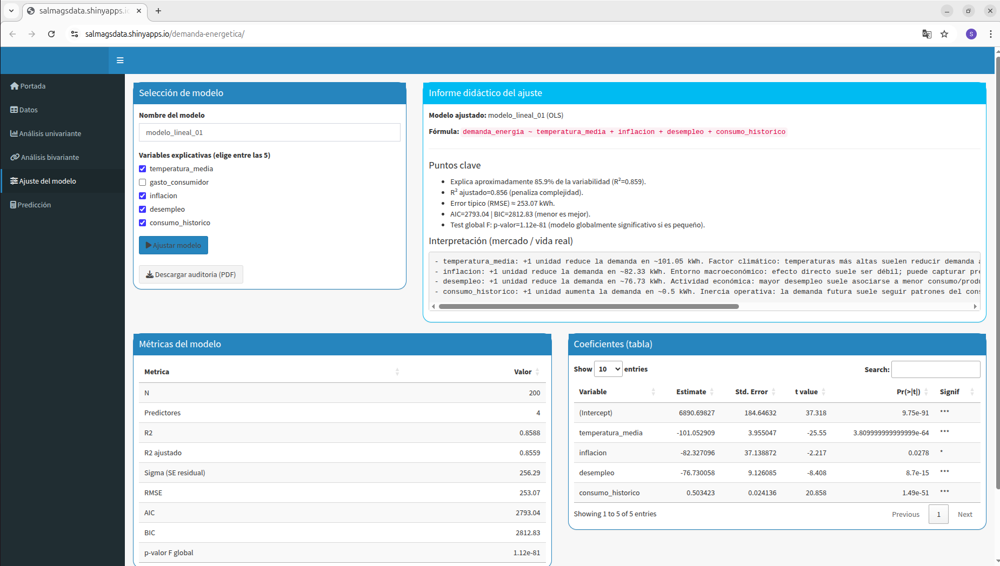
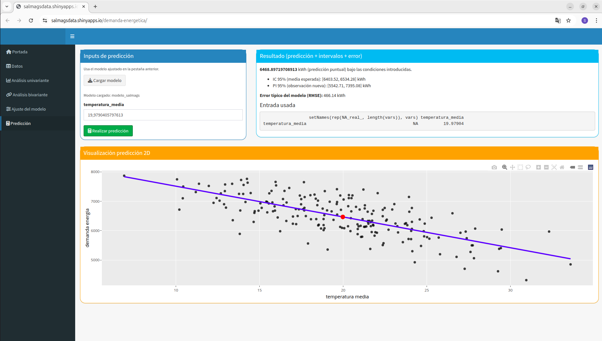

# Energy Demand Forecasting with Statistical Learning and Interactive Shiny Dashboard

This repository presents a **data science project developed in R** focused on modeling and analyzing energy demand using statistical learning techniques.

The project combines **exploratory data analysis, regression modeling, model diagnostics, and an interactive Shiny dashboard** that allows users to explore relationships between climate, economic indicators, and energy consumption.

The work was developed as part of the course **Matemáticas Aplicadas a la Inteligencia Artificial** and illustrates how statistical models can support **energy demand forecasting and decision-making scenarios**.

---

# Project Highlights

- Statistical modeling of energy demand using **multiple linear regression**
- Variable selection using **exhaustive search and stepwise methods**
- Model validation through **cross-validation and information criteria**
- Diagnostic analysis of regression assumptions
- Exploration of **regularization techniques (Ridge / Lasso / Elastic Net)**
- Development of an **interactive Shiny dashboard for model exploration and prediction**
- Fully reproducible workflow using **R Markdown**

---

# Interactive Shiny Dashboard

An interactive dashboard was developed to explore the dataset and the predictive model in a dynamic way.

The dashboard allows users to:

- Select explanatory variables
- Fit and evaluate regression models
- Explore variable relationships
- Generate predictions with confidence intervals
- Visualize model diagnostics

---

## Model fitting interface





This interface allows users to configure regression models, inspect coefficients, evaluate statistical significance, and analyze model fit.

---

## Prediction interface



Users can generate energy demand predictions by modifying input variables such as temperature, economic indicators, and historical consumption.

Prediction intervals provide a visual representation of uncertainty in the forecasts.

---

# Repository structure


```markdown
energy-demand-modeling-r/
│
├── app.R
├── report.Rmd
├── data/datos.csv
├── energy-demand-modeling-r.Rproj
├── .gitignore
│
├── example-output/
│ ├── report.pdf
│ ├── model-fit.png
│ └── prediction.png
``` 
---

# Statistical Methodology

The analysis follows a complete modeling workflow:

1. Data exploration and descriptive analysis  
2. Bivariate analysis and correlation study  
3. Variable selection using exhaustive and stepwise methods  
4. Cross-validation for predictive evaluation  
5. Regression diagnostics (outliers, leverage, influence)  
6. Multicollinearity assessment  
7. Model validation and interpretation  
8. Comparison with regularized models  
9. Evaluation of interaction effects  

This process results in a **parsimonious and interpretable regression model capable of explaining a large proportion of the variability in energy demand**.

---

# Dataset

The dataset contains variables from three domains:

### Climate variables
- temperatura_media

### Economic indicators
- gasto_consumidor
- inflacion
- desempleo

### Energy variables
- consumo_historico
- demanda_energia

These variables are used to construct predictive models that link **economic activity, climate conditions, and historical energy usage**.

Note: The dataset used in this project was synthetically generated for educational purposes and does not contain real-world data.

---

# Running the Project

- Clone the repository:

```r
git clone https://github.com/sghailan/energy-demand-modeling-r.git
``` 

- Run the interactive dashboard:

```r
shiny::runApp()
``` 

Or compile the analytical report:

```r
rmarkdown::render("report.Rmd")
``` 

# Technologies used

- R
- Shiny
- R Markdown
- ggplot2
- glmnet
- olsrr
- leaps
- car
- DAAG

# Author

Salma Ghailan Serroukh

# Notes

This repository focuses on the statistical methodology and reproducible workflow used to build and evaluate the predictive model, as well as the development of an interactive visualization tool for exploring the results.